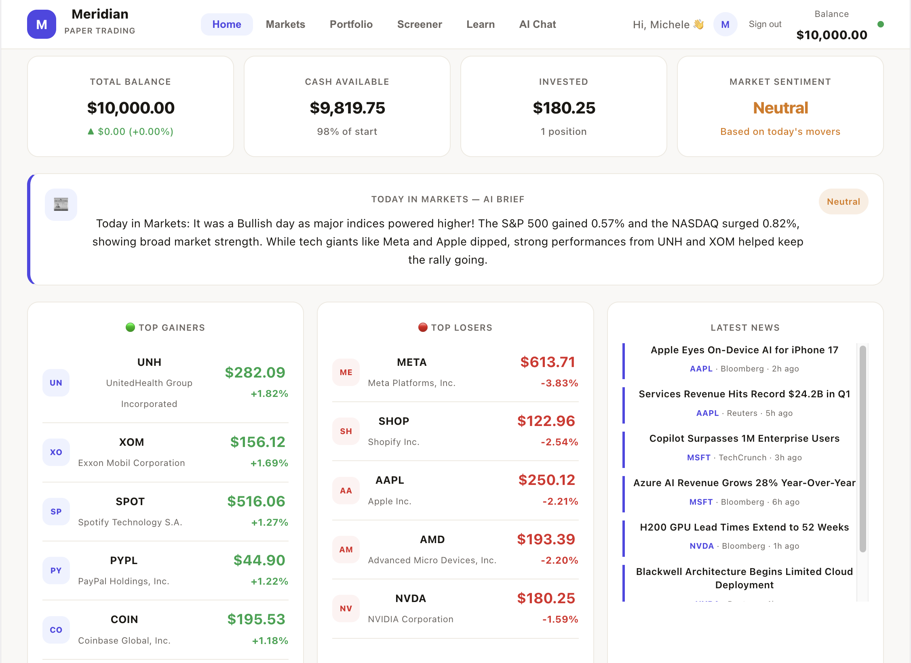

# Meridian — Paper Trading Platform for Students

> Learn investing with $10,000 of paper money, live market data, and an AI tutor that explains everything in plain English.

**Live Demo:** https://meridian-lac-seven.vercel.app/



---

## What it does

Most students want to learn investing but are afraid to lose real money. Meridian gives them a safe environment to practice, with real market data, a fake $10,000 starting balance, and an AI assistant that explains concepts as they trade.

It's not a toy. It uses live prices from Yahoo Finance, real news, and Google Gemini to provide analysis — but no real money ever changes hands.

---

## Features

### Paper Trading
- Start with **$10,000** in virtual cash
- **Buy and sell** any of 20 stocks with one tap
- Real-time P&L tracking per position
- Full trade history log
- **Leaderboard** — compete with other students

### Live Market Data
- Real prices via **Yahoo Finance** (refreshed every 60 seconds)
- 60-day price charts with historical data
- Key metrics: P/E, EPS, Beta, 52-week range, volume
- Market indices bar: S&P 500, NASDAQ, DOW, VIX, BTC, Gold

### AI Layer (Google Gemini)
- **"What does this company do?"** — plain English explanation for every stock
- **News summarization** — themes, risks, sentiment from recent headlines
- **Investment view** — structured bull/bear case with risk label
- **AI Chat** — ask anything about your portfolio, a stock, or how markets work
- AI never fabricates prices or data — it only interprets what's already on screen

### Stock Screener
- Filter by sector, sort by price, P/E, beta, daily change
- Risk labels on every stock: Conservative / Moderate / Aggressive
- Direct buy button from screener

### Student-Friendly Design
- Plain-English company descriptions on every stock page
- Hover tooltips explaining financial terms (P/E, Beta, EPS)
- Clean, minimal interface inspired by GoodNotes

---

## Tech Stack

| Layer | Technology |
| Frontend | React + Recharts |
| Hosting | Vercel |
| Market Data | Yahoo Finance (`yahoo-finance2`) |
| AI | Google Gemini 2.0 Flash (free tier) |
| API Routes | Vercel Serverless Functions |
| Styling | Inline React styles (no CSS framework) |

---

## Architecture

The app is built on a strict separation between the **data layer** and the **AI layer**:

```
┌─────────────────────────────────────────┐
│              React Frontend             │
├──────────────────┬──────────────────────┤
│   Data Layer     │     AI Layer         │
│  (deterministic) │  (interpretation)    │
│                  │                      │
│  /api/quote.js   │  /api/ai.js          │
│  /api/history.js │  → Gemini API        │
│  /api/news.js    │                      │
│  → Yahoo Finance │                      │
└──────────────────┴──────────────────────┘

**AI is never used for:**
- Stock prices or quotes
- Portfolio calculations
- Chart data
- Sorting or filtering

**AI is only used for:**
- Summarizing news articles that were already fetched
- Generating investment thesis based on real available data
- Answering student questions about the app's actual data

This means the app works fully even if the AI is turned off.

---

## Getting Started

```bash
# Clone the repo
git clone https://github.com/yourusername/meridian.git
cd meridian

# Install dependencies
npm install
npm install yahoo-finance2

# Add environment variables
echo "GEMINI_API_KEY=your-key-here" > .env.local

# Run locally
npx vercel dev
```

Get a free Gemini API key at [aistudio.google.com](https://aistudio.google.com) — no credit card needed.


## Project Structure

```
meridian/
├── src/
│   └── App.jsx          # Full React app (~900 lines)
├── api/
│   ├── quote.js         # Live stock quotes (Yahoo Finance)
│   ├── history.js       # 60-day price history (Yahoo Finance)
│   ├── news.js          # Recent news headlines (Yahoo Finance)
│   └── ai.js            # Gemini AI proxy (secure, key never in frontend)
├── .env.local           # API keys (not committed)
└── vercel.json          # Serverless function config
```

---

## Why I built this

I'm a student and most investing tools are built for professionals. Full of jargon, real money risk, and no explanation of what anything means. I wanted something that feels like a learning tool first and a trading platform second.
The AI layer was designed to teach, not to replace thinking. It explains, it summarizes, it answers questions — but it never makes decisions for you.

---

## Roadmap

- [ ] Persistent leaderboard with real user accounts
- [ ] Portfolio performance chart over time
- [ ] Price alerts and notifications
- [ ] Mobile-responsive layout
- [ ] Multi-currency support

---

## Built with

- [yahoo-finance2](https://github.com/gadicc/yahoo-finance2) for market data
- [Recharts](https://recharts.org) for charts
- [Google Gemini](https://aistudio.google.com) for AI features
- [Vercel](https://vercel.com) for hosting and serverless functions

---

*Paper trading only. No real money involved. Not financial advice.*
